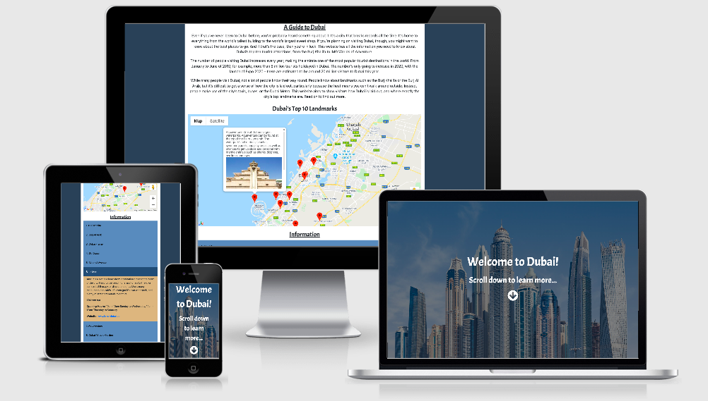

# Dominic Beesley’s 2nd Milestone Project

The aim of this project is to build an interactive front-end site, which should respond to users’ actions, allowing users to actively engage with data, and alter the way the site displays this information in order to achieve their preferred goals, using all the technologies that I've learned about so far, for Code Institute. 

To do this, I’ve created a website that’s a guide to Dubai, a city in the UAE. I used my knowledge of the city to do this, as I lived there for several years, and felt like I know more than the average tourist might know.

## UX 

The goal of the website, as outlined in the site’s introduction, is to be a guide for visitors to Dubai. Many visitors to Dubai don’t know of many landmarks other than the Burj Khalifa, for example, and with this website I aim to provide information on a wide range of landmarks that tourists might like to know about, from theme parks to art galleries. 

A lot of tourists also don’t know where places are in relation to other places. If they don’t leave their hotel, they might not get a sense of where they are. With the map, I can show where the landmarks are, and have tried to spread the landmarks out, choosing places on the coast as well as in the city centre.

A wireframe for the website can be found [here](assets/wireframes/milestone2wireframe.pdf).

### User Stories
For users:
* As a user, I want to learn more about Dubai.
* As a user, I want to learn about Dubai tourist attractions.
* As a user, I want to know where these attractions are.
* As a user, I want to know what they look like.
* As a user, I want to find out information such as opening times, ticket prices, and where the official website is.

For the site owner:
* As the site owner, I want to clearly communicate the goals of the website.
* As the site owner, I want to make it clear that the website is about Dubai.
* As the site owner, I want to let the user know where ten different tourist attractions are.
* As the site owner, I want to educate the user about the attractions.

## Features 

### Existing Features
Arrow icon – When the user clicks on the down arrow in the site’s header, the page will scroll down to show more of the content. The code for this can be found at assets/js/accordion.js.

Map of Dubai – made with the [Google Maps API](https://developers.google.com/maps/documentation). The code for the map can be found at assets/js/map.js.

Accordion panel – this gives more information on the top 10 landmarks. When the name is clicked, the panel of information will appear, and disappear when clicked again. The code for this can be found at assets/js/accordion.js.

## Technologies Used 

### Programming Languages
* [HTML](https://www.w3schools.com/html/default.asp) – for creating the structure and layout of the website.
* [CSS](https://www.w3.org/Style/CSS/) – for styling the website’s content.
* [Bootstrap](https://getbootstrap.com/) – for styling the website’s content.
* [Javascript](https://www.javascript.com/) – for integrating the Google Maps API.
* [jQuery](https://jquery.com/) – for the function that makes the page scroll down.
* [Markdown](https://www.markdownguide.org/) – for styling the content of this README.md.

### Fonts
* [FontAwesome](https://fontawesome.com/) – I used the font ‘Acme’ for the text in the header and the titles. 

### Websites
* [Am I Responsive?](http://ami.responsivedesign.is/#) - to test responsiveness of the site.
* [Color Scheme Designer](http://colorschemedesigner.com/csd-3.5/) - to choose the colours of the website.
* [W3C Markup Validation service](https://validator.w3.org/) - to check the HTML.
* [W3C CSS Validation Service](https://jigsaw.w3.org/css-validator/) - to check the CSS.

## Testing 

I tested the website on multiple browsers and screen sizes, to ensure that it worked and displayed all the content correctly for the user, and that the contents were responsive on different screen sizes. I also got several friends and members of my family to test the website and ensure that everything worked as it was meant to for them, and that they didn’t have any questions to be addressed.

Using [Am I Responsive?](http://ami.responsivedesign.is/#), I was able to see how the website would look on different screen sizes.

## Deployment 

The website is deployed using [GitHub Pages](https://pages.github.com/). 

On the page for the GitHub repository for this project, I went to Settings.

I scrolled down to the GitHub Pages section. 

I chose Master Branch as the source, and this gave me the link to where the site is hosted on GitHub Pages. It’s deployed from the master branch, and will update automatically.

## Credits 

### Content
I worked out how to make the accordion panel in the information section work with the help of [W3schools.com]( https://www.w3schools.com/howto/howto_js_accordion.asp).

To work out which colours would work well on the website together, I used [Color Scheme Designer](http://colorschemedesigner.com/csd-3.5/). I wanted to use blue, as there was a lot of blue in the header image, and this website allowed me to find complementary colours.

I validated the HTML code using the [W3C Markup Validation service](https://validator.w3.org/), and no errors were found.

I validated the CSS code using the [W3C CSS Validation Service](https://jigsaw.w3.org/css-validator/), and no errors were found.

### Media
The header image, of a Dubai skyline, is from [here](https://www.pexels.com/photo/architectural-design-architecture-buildings-business-618079/).

The images for the top 10 landmarks are from:
1. [Burj Khalifa](https://www.pexels.com/photo/blue-and-gray-high-rise-building-162031/)
2. [Burj Al Arab](https://www.pexels.com/photo/burj-al-arab-dubai-2044434/)
3. [Dubai Frame](https://pixabay.com/photos/dubai-picture-frame-museum-luxury-4265306/)
4. [Ski Dubai](https://www.kempinski.com/en/dubai/mall-of-the-emirates/local-information/family-adventures/ski-dubai/)
5. [Alserkal Avenue](https://www.timeoutdubai.com/culture/art/394647-free-al-quoz-arts-fest-resturns-to-alserkal-avenue)
6. [La Mer](https://www.bayut.com/mybayut/la-mer-dubai-opening-restaurants-beach/)
7. [Aquaventure](https://www.flickr.com/photos/travelourplanet/8973483064)
8. [Miracle Garden](https://www.pexels.com/photo/aerial-photography-of-park-with-airplane-1302991/)
9. [Dubai Opera](https://unsplash.com/photos/iG4Ut-x8zH8)
10. [IMG Worlds of Adventure](https://ui.cltpstatic.com/camp/images/ai/000/931/006/931006/published/w/img-worlds-of-adventures-1563266993-5.jpg)

### Social Media
The links to the Visit Dubai social media pages in the footer are Dubai’s official [Facebook]( https://www.facebook.com/visitdubai.UK), [Twitter]( https://twitter.com/visitdubai), [YouTube]( https://www.youtube.com/visitdubai), and [Instagram]( https://www.instagram.com/visit.dubai/) pages.

### Statistics
The tourism statistics from the [Tourism In Dubai Wikipedia page](https://en.wikipedia.org/wiki/Tourism_in_Dubai).

### Acknowledgements
I received inspiration and guidance for this project from my mentors, Antonija Šimić and Oluwaseun Owonikoko.

